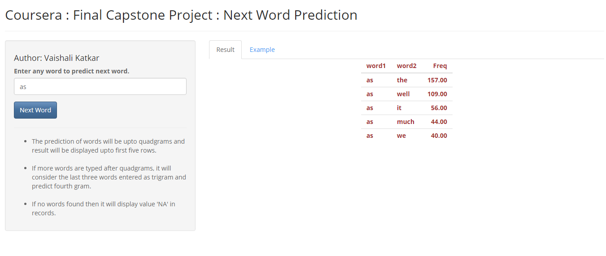

Coursera : Final Capstone Project : Next Word Prediction
========================================================
author: Vaishali Katkar
date: 03-Dec-2017
autosize: true
font-family: 'Helvetica'
transition: linear

Objective
========================================================

This is a final Capstone project with the basics, analyzing a large corpus of text documents to discover the structure in the data and how words are put together. It will cover cleaning and analyzing text data, then building and sampling from a predictive text model. Finally, you will use the knowledge you gained in data products to build a predictive text model.   
Pre-requisite Readings :   
- Natural language processing Wikipedia page    
- Text mining infrastucture in R    
- CRAN Task View: Natural Language Processing    

<b> Dataset :  </b>
Download the data from the link below :
https://d396qusza40orc.cloudfront.net/dsscapstone/dataset/Coursera-SwiftKey.zip

Understanding the Problem
========================================================

This is to understand corpus in the data. Below are few things to be noted from the given corpus data.

-  The data contains lot of unnecessary noise and other foreign words and words from different encodings.
-  Most of the words repeat only few times, so associating each words with other is important to predict the next word.
-  We select only english language words by using a regular expression.
Download and load data successfully.

Note : Before following below code, please download data from mentioned link in slide 2.

Basic report of summary statistics about the data sets
========================================================
<small>
- Total Number of Lines 
- Total Number of Words
  

   
  
As the all files have data more than 200000 words, it will take huge time and resources to process. To avoid this situation, consider only first 4000 rows from each file as a subset which represents sample data.
</small>    

Tasks to accomplish:
========================================================
<small>
-  Cleaning Data 
-  Tokenization 
     * Identifying appropriate tokens such as words, punctuation, and numbers. 
     *  Writing a function that takes a file as input and returns a tokenized version of it.
     *  Convert non English language text to ASCII
     *  removing special characters, punctuations and unwanted words.
-  Get Ngrams
-  Prepare DocumentTermMatrix
-  Get Frequencies        
After completion of above tasks, save Ngrams.
</small>

Prepare prediction model for the Ngrams saved
========================================================
<small>
Stupid back-off method is used to predict next word.   
The shiny app is prepared is available at below link <a href="https://katkarvaishali.shinyapps.io/FinalCapstone_NextwordPredict/" target="_top"/>here</a>       
-  Tab Results will display result for predicted first five words.   
-  Tab Example will give a sample   
    
</small>
